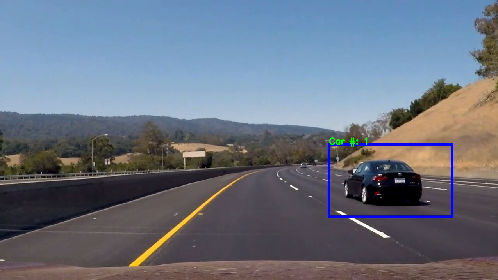

# Korda's Vehicle Detection Project 5 for Udacity Self-Driving Car Nanodegree

[YouTube Video](https://youtu.be/8hazstEff0o)
[](https://youtu.be/8hazstEff0o)

---

The goals / steps of this project are the following:

* Perform a Histogram of Oriented Gradients (HOG) feature extraction on a labeled training set of images and train a classifier Linear SVM classifier
* Optionally, you can also apply a color transform and append binned color features, as well as histograms of color, to your HOG feature vector. 
* Note: for those first two steps don't forget to normalize your features and randomize a selection for training and testing.
* Implement a sliding-window technique and use your trained classifier to search for vehicles in images.
* Run your pipeline on a video stream (start with the test_video.mp4 and later implement on full project_video.mp4) and create a heat map of recurring detections frame by frame to reject outliers and follow detected vehicles.
* Estimate a bounding box for vehicles detected.

## [Rubric](https://review.udacity.com/#!/rubrics/513/view) Points
###Here I will consider the rubric points individually and describe how I addressed each point in my implementation.  

---
### Writeup / README

#### 1. Provide a Writeup / README that includes all the rubric points and how you addressed each one.  You can submit your writeup as markdown or pdf.

You're reading it!

### Histogram of Oriented Gradients (HOG)

####1. Explain how (and identify where in your code) you extracted HOG features from the training images.

The code for this step is contained in the fourth code cell of the IPython notebook.  

I started by reading in all the `vehicle` and `non-vehicle` images.  Here is an example of one of each of the `vehicle` and `non-vehicle` classes:

![alt text][1]

  [1]: ./output_images/carnotcar.png 

I then explored different color spaces (`LUV`, `HSV`, `YCrCb`, `RGB`) and different `skimage.hog()` parameters (`orientations`, `pixels_per_cell`, and `cells_per_block`). I found that HOGs were recognized best in the HSV color space. I also plotted the different color spaces in a 3D plot to see if I could find grouping of colors that might be useful to my classifier later.

Here is an example using the `HSV` color space and HOG parameters of `orientations=8`, `pixels_per_cell=(8, 8)` and `cells_per_block=(2, 2)`:


![alt text][2]

  [2]: ./output_images/carHOG.png

#### 2. Explain how you settled on your final choice of HOG parameters.

I began with the parameters set in class and started tweaking. First, I tried more pixels per cell `(16, 16)`. That actually made the HOGs less pronounced. Then, I tried reducing the cells per block to `(1, 1)`. That didn't seem to have much of an effect on the output.
The most important choice I made was the `HSV` color space, it really made the vehicles pop in the histograms bining of color.

#### 3. Describe how (and identify where in your code) you trained a classifier using your selected HOG features (and color features if you used them).

I began my search for the right classifier with the `LinearSVC` described in the lessons. Right our of the box without tuning any SVC parameters it worked fairly well, yielding 98.9% accuracy on a 20% test set. I wanted more but wasn't sure how much more I could get, so I started looking at other options. I tried SVC with an `rbf` kernel instead of `linear`. That seemed to take far too long to train with little added accuracy. So I went back to `linear` and did a `GridSearchCV` on the following tuning parameters:

```tuned_parameters = [{'C': [1, 10, 100, 1000], 'kernel': ['linear']}, 
                      {'C': [1, 10], 'gamma': [0.001, 0.0001], 'kernel': ['rbf']},]```
                      
I took hours but I felt like it was worth it to squeak out a few extra tenths of percent accuracy. I finally landed on `C=100` with a `linear` kernel. This kernel was 5 times faster than the `rbf`, and since we are processing vehicle images I wanted the fastest possible predicitons (they were still way too slow for real-world processing).

### Sliding Window Search

#### 1. Describe how (and identify where in your code) you implemented a sliding window search.  How did you decide what scales to search and how much to overlap windows?

I decided to use the HOG sub-sampling method talked about in the lessons (code cell 12). It seemed the most efficient way to search the image. This method extracts the HOG features once for the whole image and then a sliding window search it performed on a region of interest, `y=(390, 650)` to sample the HOG features. Then the corresponding image patch is sampled, spatially binned and color histogram binned before stacking together with the HOG features and fed into the `SVC` for prediction.

### Here is a sample of the features extracted as a signature:

![alt text][24]

  [24]: ./output_images/carrawnorm.png

Once predictions are made the coordinates of the window that was searched are stored in a `Box()` class if they were a match. Those coordinates were later used to add hot pixels to a heatmap.

### Here is the search area used:

![alt text][3]

  [3]: ./output_images/searcharea.png
  
### Here are the four scaled window sizes and the detections they picked up:
  
![alt text][20]

  [20]: ./output_images/scaling0.png
  
![alt text][21]

  [21]: ./output_images/scaling1.png
  
![alt text][22]

  [22]: ./output_images/scaling2.png
  
![alt text][23]

  [23]: ./output_images/scaling3.png
  

#### 2. Show some examples of test images to demonstrate how your pipeline is working.  What did you do to optimize the performance of your classifier?

There were many optimizations and I spent far too long tweaking parameters. I ended up performing a sliding window search at 4 different scales while using HOG, color histogram, and spatial bin features. The overall accuracy of the `SVC` ended up being 99.07% which isn't too bad but still pops a lot of false positives. More on that later. Below are some examples of images of my pipeline running on test video.

Here is a view of what the pipeline produces

![alt text][4]

  [4]: ./output_images/carsheatmap.png
 
  
---

### Video Implementation

#### 1. Provide a link to your final video output.  Your pipeline should perform reasonably well on the entire project video (somewhat wobbly or unstable bounding boxes are ok as long as you are identifying the vehicles most of the time with minimal false positives.)
Here's a [link to my video result](./project_video.mp4)


#### 2. Describe how (and identify where in your code) you implemented some kind of filter for false positives and some method for combining overlapping bounding boxes.

I recorded the positions of positive detections in each frame of the video.  From the positive detections I created a heatmap and then thresholded that map to identify vehicle positions.  I then used `scipy.ndimage.measurements.label()` to identify individual blobs in the heatmap.  I then assumed each blob corresponded to a vehicle.  I constructed bounding boxes to cover the area of each blob detected.

Inorder to trying to smooth out the jittery nature of the heatmap I implemented a method of keeping the previous heatmap and adding to it. I would start each new frame with the previous heatmap cooled off by -5 on every hot pixel. This kept some history of where the cars had been (like an infrared camera that sees where you have placed a hand on the wall). The -5 cooling of pixels insured the areas that didn't see any new detections would cool off and disappear. This served to stabilize the boxes somewhat.

I tried for days to implement a good averaging scheme by storing the last 20 bounding boxes and keeping a moving average, but the labels would change between cars and it ended up averaging between the two cars.

Here's an example result showing the heatmap from a series of frames of video and the bounding boxes then overlaid on the last frame of video with the result of `scipy.ndimage.measurements.label()` label over the top of the bounding boxes:

### Here are six frames and their corresponding heatmaps with labels and bounding boxes:

![alt text][5]

  [5]: ./output_images/heatmapseq1.png
  
![alt text][6]

  [6]: ./output_images/heatmapseq2.png
  
![alt text][7]

  [7]: ./output_images/heatmapseq3.png
  
![alt text][8]

  [8]: ./output_images/heatmapseq4.png
  
![alt text][9]

  [9]: ./output_images/heatmapseq5.png
  
![alt text][10]

  [10]: ./output_images/heatmapseq6.png


---

### Discussion

#### 1. Briefly discuss any problems / issues you faced in your implementation of this project.  Where will your pipeline likely fail?  What could you do to make it more robust?

Here I'll talk about the approach I took, what techniques I used, what worked and why, where the pipeline might fail and how I might improve it if I were going to pursue this project further.  

As mentioned before I spent a lot of time trying to smooth and average the boxes over multiple frames. Alas, I was only able to implement the heatmap history and cooling to achieve the final result. There are more false positives than I would have liked to have seen, even though I agressively thresholded the heatmap for any detections below 5. I would have tried more but I was afraid it would start taking away from my true positives. Also the processing of the video took about a min per second so I am sure I have some nasty code that is being very inefficient. The `SVC` prediction time was very fast per label at 0.002 seconds, but that is for only one window the nearly 10,000 windows it searches each frame of video. That equates to approximately 60 secs per second of video. This is a big shortcoming of my project since in the real-world this needs to be implemented at least 10Hz to be fast enough to react to the world. 

The biggest improvements I would like to make are: false positive reduction through more aggressive thresholding, bounding box stabilization and smoothing, vehicle trajectory and distance estimation, and stiching together with my lane finding algorithm for a more complete view of the world.

P.S.

Thanks to all the creators of Udacity and this project. Like all before, it was challenging and a huge learning experience. I would never have done something like this without your help. You expand my horizons everyday. Cheers!

